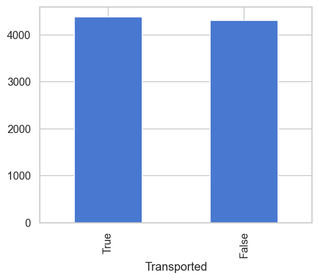
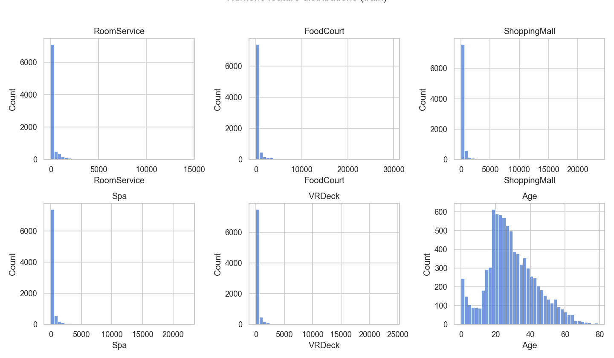
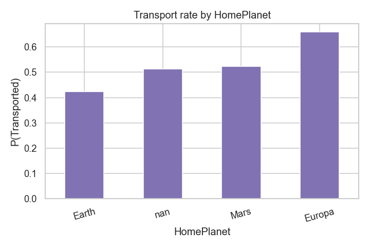

# Distribution Report — Agent 1

## Numeric features (train)

| Feature | Mean | Median | Std | Skew | Kurtosis |
|---------|------|--------|-----|------|----------|
| Age | 28.83 | 27.00 | 14.49 | 0.42 | 0.10 |
| RoomService | 224.69 | 0.00 | 666.72 | 6.33 | 65.27 |
| FoodCourt | 458.08 | 0.00 | 1611.49 | 7.10 | 73.31 |
| ShoppingMall | 173.73 | 0.00 | 604.70 | 12.63 | 328.87 |
| Spa | 311.14 | 0.00 | 1136.71 | 7.64 | 81.20 |
| VRDeck | 304.85 | 0.00 | 1145.72 | 7.82 | 86.01 |
| TotalSpend | 1440.87 | 716.00 | 2803.05 | 4.42 | 27.48 |

Spend columns are **right-skewed** with many zeros (especially under cryosleep). Prefer robust scaling or tree models; log1p transform is optional for linear models.

## Categorical transport rates (train)

### HomePlanet

| Value | P(Transported) |
|-------|----------------|
| Earth | 0.424 |
| Europa | 0.659 |
| Mars | 0.523 |
| nan | 0.512 |

### CryoSleep

| Value | P(Transported) |
|-------|----------------|
| False | 0.329 |
| True | 0.818 |
| nan | 0.488 |

### Destination

| Value | P(Transported) |
|-------|----------------|
| 55 Cancri e | 0.610 |
| PSO J318.5-22 | 0.504 |
| TRAPPIST-1e | 0.471 |
| nan | 0.505 |

### Cabin side (parsed)

| Side | P(Transported) |
|------|----------------|
| P | 0.451 |
| S | 0.555 |
| <NA> | 0.503 |

## Group size

| Stat | Value |
|------|-------|
| Min | 1 |
| Median | 1 |
| Max | 8 |
| Mean | 1.40 |

Most groups are single passengers; larger groups are candidates for aggregate features.
