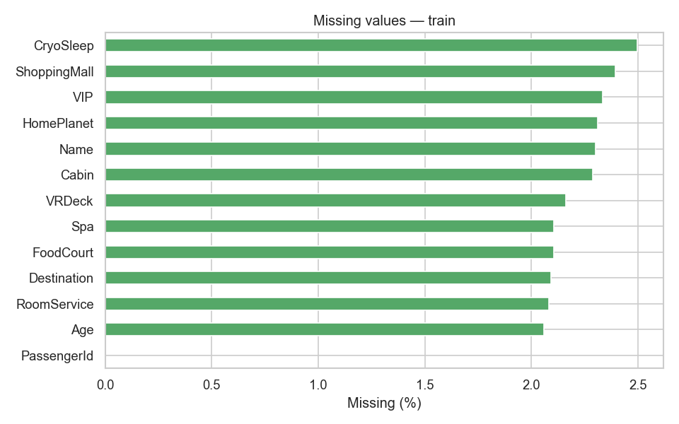

# Missing Value Report — Agent 1

## Volume

| Dataset | Columns with any missing | Max missing % |
|---------|--------------------------|---------------|
| Train | 12 | 2.50% |
| Test | 12 | 2.48% |

Label `Transported` has **no** missing values in train.

## Per-column (train)

| Column | Missing % | P(Transported) when missing | P(Transported) when present | Δ |
|--------|-----------|----------------------------|-----------------------------|---|
| HomePlanet | 2.31% | 0.512 | 0.503 | +0.009 |
| CryoSleep | 2.50% | 0.488 | 0.504 | -0.016 |
| Cabin | 2.29% | 0.503 | 0.504 | -0.001 |
| Destination | 2.09% | 0.505 | 0.504 | +0.002 |
| Age | 2.06% | 0.503 | 0.504 | -0.001 |
| VIP | 2.34% | 0.512 | 0.503 | +0.009 |
| RoomService | 2.08% | 0.459 | 0.505 | -0.046 |
| FoodCourt | 2.11% | 0.541 | 0.503 | +0.038 |
| ShoppingMall | 2.39% | 0.548 | 0.503 | +0.046 |
| Spa | 2.11% | 0.497 | 0.504 | -0.006 |
| VRDeck | 2.16% | 0.521 | 0.503 | +0.018 |
| Name | 2.30% | 0.505 | 0.504 | +0.001 |

## Pattern assessment

- Missing rates are **similar across train and test** (~2%), suggesting a stable mechanism.
- Missing **spend** rows tend to have **higher** transport probability (Δ up to ~+0.05), which may indicate missing-not-at-random (e.g. billing system gaps for transported passengers).
- **CryoSleep** missing rows are slightly less likely transported (Δ ≈ -0.016).
- No evidence that missingness is independent of the target; **imputation strategy should be chosen carefully** (mode/median, group-based, or explicit missing indicators).

## Recommendations for Agent 2

1. Add binary `is_missing_<col>` flags for spend columns if using mean/median imputation.
2. Consider **group-level imputation** for cabin/planet when passengers share a `GroupId`.
3. Apply the **same pipeline** to train and test.
